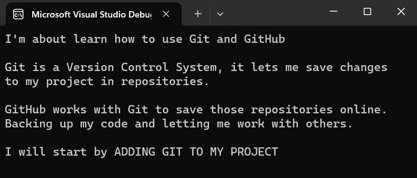
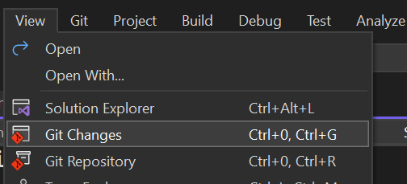
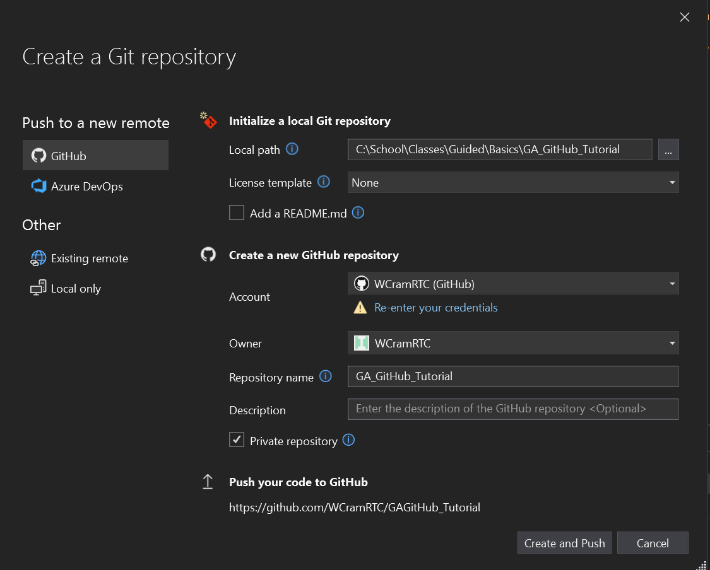
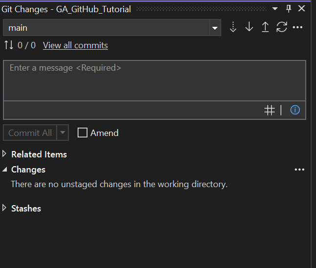
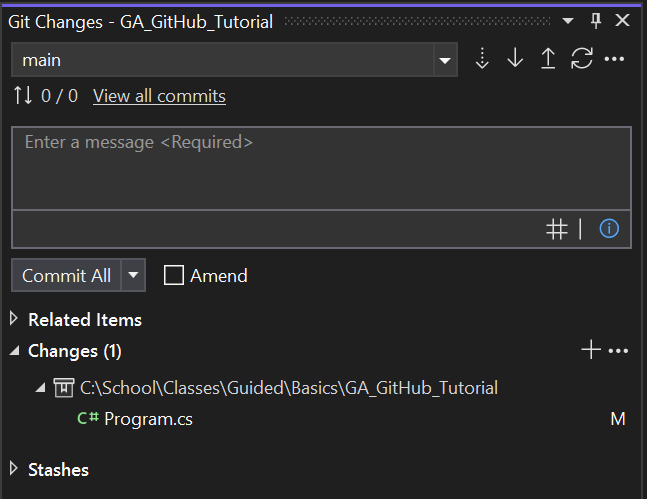
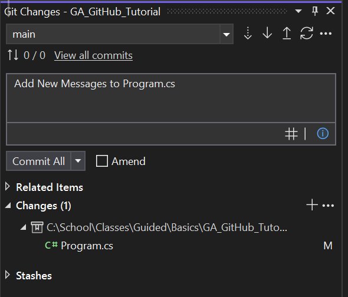

# GA_GitHub_Tutorial

### Step 1
`Do This`

>Replace "Hello, World" with the message   
> ***I"m about to learn how to use Git and GitHub***

~~**`Console.WriteLine("Hello, World");`**~~

```csharp 
	public static void Main(string[] args) {
		Console.WriteLine("I'm about learn how to use Git and GitHub");
	}
``` 

*Save and run*

### Step 2

`Do This`

> Now add in separate `Console.WriteLines()` add the following messages. Make sure to add a new Line in between each to give them space. `\n`

> - Git is a Version Control System, it lets me save changes to my project in repositories.
> - GitHub works with Git to save those repositories online. Backing up my code and letting me work with others. 
> - I will start by ADDING GIT TO MY PROJECT

***Save and Run***



`Process`

Now on the top menu click **View** and Click `Git Changes`



This will open a new window called `Git Changes`.


### Step 3

`Do This`

> In add the following messages to your code

> - **Adding Git To My Project
> - In order to add Git to my project, I have to add a .git folder to my project.
> - I can do this my clicking *Create Git Repository*
> - This will bring up a new window that lets me add Git to my project.


---

`Process`
### Click "Create Git Repository"




Lets break down where we see here

**Initialize A Repository**

- Local Path : This is the location where your project is on your hard drive
- License Template : Don't worry about this now
- [x] Add README.md : This is a file that will allow you to display information. **Check This**

**Create a new GitHub Repository**
- Account : This is the name of your GitGub account, if this is your first time doing this on GitHub, you may have to log in.
- Owner: This should be your user name. It will auto fill when you log in.
- Repository Name: This will be the name of your project, online, on GitHub.
- [ ] Private Visibility ( **For Assignments: Make sure this is unchecked** ): This toggles if your Repository public or private. 
    - Checked: Your repository cannot be seen by anyone else.
	- Unchecked: Your repository is public and can be seen by others.

**Push you code to GitHub**
- A web url: This is the internet address for your github repository. If you go to this location, you will see your repository. You can also find this by going to www.github.com. 

---

### For Your Projects

- **Check Add README.md**
- **Uncheck Private Repository**
- **Click Create and Push**


You've have now added Git to your project.

If it worked properly your ***Git Changes*** window will change. 



---

### Step 4

You only have to **Add Git Once** to your project. Now we will learn the next 2 steps: ***`Commit`*** and ***`Push`***.

`Code This`

> Add these messages
>
> - I have added Git to my project.
> - I can now start committing my changes
> - Committing is how we tell Git to remember what changes I've made.
> - I can easily do this by Adding a Message and clicking commit in the Git Changes window

***Save and Run***

`Do This`

Now that we've changed our `Program.cs` file, lets look at our **Git Changes** window.



Since we've ***Updated and Saved our `Program.cs` file*** we can see our `Program.cs` file listed under ***Changes***. This mean we have updates we can ***`Commit`*** to our **Git**.

> ***What is committing?***

> Committing is when we tell Git to remember our new changes. Think of it like saving a current copy of the project. Except it's not saving the FULL project again. It is only keeping track of the changes between now and our last commit.

To ***`Commit`*** our changes to Git. You will enter in a message explaining the changes you made to your code in the Message TextBox. Following by clicking the ***`Commit All`*** button.

- In the MessageBox in our Git Changes window, type the message
    - **Add New Messages to Program.cs**
- Then click the ***`Commit All`*** button beneath the box.



`Program.cs` should now be gone from underneath ***Changes***.
